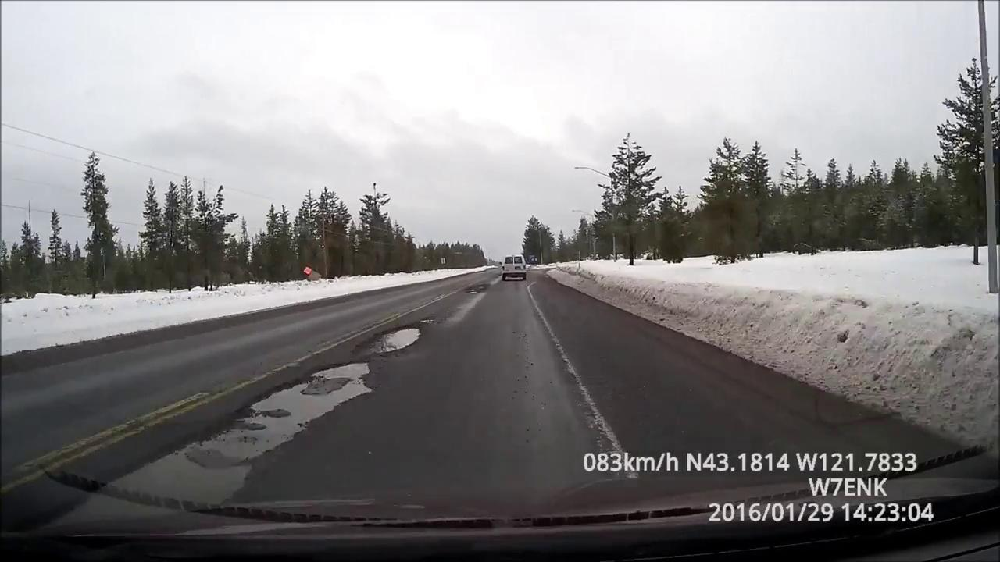

# MaskRCNN-InstanceSegmentation


## CV Task:Instance Segmentation
#### Object Detection

物件偵測:用矩行框把物件一個一個框出來，可以區分個體，但不能切割出輪廓。

#### Semantic Segmentation

語意分割:可以精細的切出輪廓但不能區分個體，像是這張圖片可以知道這團都是人但不知道有幾個人

#### Instance Segmentation

Instance Segmentation 會對圖片中的每一個像素點做分類,並且區分不同的物件。圖中的人可以區分個體又可以切割出輪廓。

---  
### Deep learning framework
Tensorflow : 1.15  
Keras : 2.3.1

## 安裝環境   
```
python setup.py install
```

或是使用requirements.txt安裝所需套件
```
pip install -r requirements.txt
```

## 訓練模型
##### 注意參數  
MODEL_DIR : 權重檔生成位置
NUM_CLASSES = 1(背景) + <label總量>   
TRAIN_ROIS_PER_IMAGE : 訓練時每張圖要生成多少ROIs  
  
dataset_root_path : 訓練資料集(原圖+轉檔後的mask)路徑  
init_with : 要從頭訓練或是做Transfer learning

設定epoch  
  
layers='head' 的意思是只訓練heads層，也就是Backbone的(預訓練)權重先凍結，先訓練其他層的權重。  
layers='all'  的意思是整個模型的權重都訓練，設定時數字要大於等於前者。  
以上圖為例，會先在凍結Backbone權重的情況下先訓練100 epochs，再將整個模型的權重一起訓練 (200-100) epochs 。

```
python train.py
```

## Inference
本任務希望在偵測時，有些類別要區分個體，但最後還是會計算這張圖中各類別的總面積，來計算占整張圖的比例。
  
要計算面積在這份code中可以善用 r\['masks'\]。  
以下圖為例，先是經過轉換後得知這張圖有300000個pixels，模型偵測出16個Instances。  
下圖中 MASK1是一個二維矩陣，其值為 True 或 False。 True就是這個pixel屬於該個Instance，反之為False。    


下圖中 將 MASK1 針對第0軸做加總，就可以得到這張圖中16個Instances 各自佔的 pixels 數。
  
後續可以將相同類別的Instance自行加總，再除以原圖的 Pixels 總數，就可以求得本任務需要的各類別占整張圖的比例 !

##### 注意參數 
weights : 以訓練完成的權重檔  
input_folder : 要做 Inference 的圖片都放到這個資料夾，並輸入其路徑  
output_folder : 做完 Inference 後存結果的資料夾路徑  
gpu : 設定是有使用GPU

```
python myInference.py \
--weights myweight.h5 \
--input_folder images \
--output_folder output_space \
--gpu True
```

input:  


Output:  
  

## Reference
[1] https://github.com/matterport/Mask_RCNN  
[2] https://www.muhendisbeyinler.net/mask-r-cnn-bir-nesne-tanima-algoritmasi  
[3] He, K., Gkioxari, G., Dollár, P., & Girshick, R. (2017). Mask r-cnn. In Proceedings of the IEEE international conference on computer vision (pp. 2961-2969).

